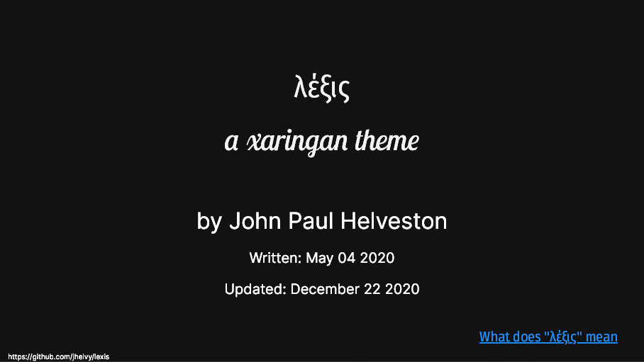

<!-- README.md is generated from README.Rmd. Please edit that file -->

# λέξις: a xaringan theme

## by John Paul Helveston

Written: May 04 2020

Updated: January 07 2021

λέξις (lexis) is a theme for the [xaringan R
package](https://github.com/yihui/xaringan) for making slides. It has a
light gray background and uses [Fira Sans
Condensed](https://fonts.google.com/specimen/Fira+Sans+Condensed) for
headers, [Inter](https://fonts.google.com/specimen/Inter) for body text,
and [SFMono-Regular](https://developer.apple.com/fonts/) for mono text
(i.e. code). The theme copies ideas from several other themes, most
notably from [Allison Hill](https://alison.rbind.io/)’s xaringan
[workshop](https://github.com/rstudio-education/arm-workshop-rsc2019).
It also uses many of the wonderful features from [Garrick
Aden-Buie](https://garrickadenbuie.com/)’s
[xaringanExtra](https://pkg.garrickadenbuie.com/xaringanExtra/#/)
package.

### Demo

  - [Preview](https://jhelvy.github.io/lexis/lexis-theme/lexis-demo-16-9.html)
    a live demo.
  - [View](https://jhelvy.github.io/lexis/lexis-theme/lexis-demo-16-9.pdf)
    the live demo slides as a pdf.
  - [Download](https://jhelvy.github.io/lexis/lexis-theme/lexis-theme.zip)
    the files to create the demo.

### How can I use this theme?

The easiest way to use this theme is to download and use the demo
template:

[Download](https://jhelvy.github.io/lexis/lexis-theme/lexis-theme.zip)

### What does “λέξις” mean?

When communicating an idea to others, there is a fundamental difference
between the *content* of what is be communicated and the *form* of how
it is communicated. Aristotle phrased this as the difference between
[λόγος (logos)](https://en.wikipedia.org/wiki/Logos), the logical
content of a speech, and [λέξις
(lexis)](https://en.wikipedia.org/wiki/Lexis_\(Aristotle\)), the style
and delivery of a speech (see also [this
article](http://rhetoric.byu.edu/Encompassing%20Terms/Content%20and%20Form.htm)
on content versus form). Since the entire purpose of making a xaringan
theme is to customize the *form* of how content is delivered, “lexis”
seemed like an appropriate name.

-----

### License

 This work is
licensed under a [Creative Commons Attribution-ShareAlike 4.0
International License](https://creativecommons.org/licenses/by-sa/4.0/).
