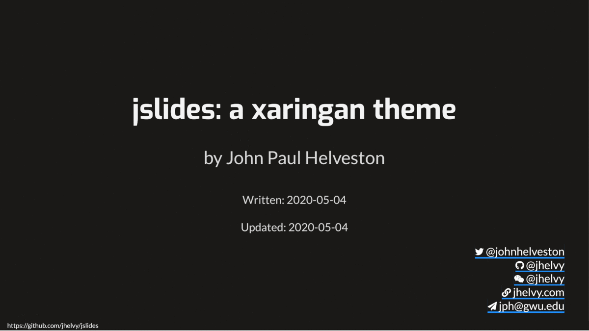

<!-- README.md is generated from README.Rmd. Please edit that file -->

# jslides: a xaringan theme

## by John Paul Helveston

Written: May 04 2020

Updated: May 10 2020

jslides is a theme for the [xaringan R
package](https://github.com/yihui/xaringan) for making slides. It has a
light gray background with distinct coloring for code block inputs and
outputs. jslides copies ideas from several other themes, but most
notably from [Allison Hill](https://alison.rbind.io/)’s xaringan styling
[this
workshop](https://github.com/rstudio-education/arm-workshop-rsc2019).

### Demo

You can preview a live demo
[here](https://jhelvy.github.io/jslides/jslides_demo.html), and you can
download the files to create that demo
[here](https://jhelvy.github.io/jslides/jslides_demo.zip)

### How can I use this theme?

If you’d like to use this theme, simply include the css in the YAML for
your xaringan slides (see example below). You technically only need the
line defining the css, but I put my full usual header here which also
adjusts the aspect ratio and highlighting styles that I prefer. The
`seal: false` bit drops the defaul title page - I like to make my own,
like I show in my [demo
slides](https://jhelvy.github.io/jslides/jslides_demo.html).

    ---
    title: "Title"
    author: "Author"
    output:
      xaringan::moon_reader:
        css: ['default', 'https://jhelvy.github.io/jslides/jslides.css']
        lib_dir: libs
        nature:
          highlightStyle: github
          highlightLines: true
          countIncrementalSlides: false
          ratio: "16:9"
        seal: false
    ---
