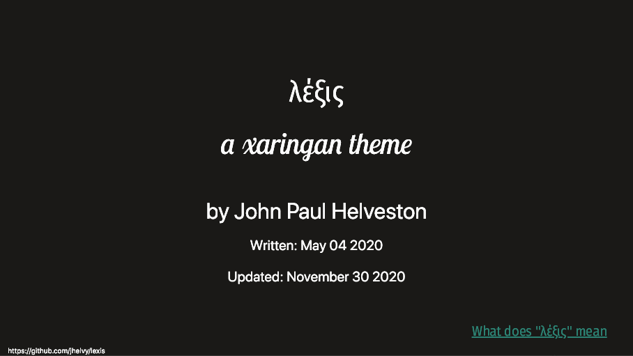

<!-- README.md is generated from README.Rmd. Please edit that file -->

# λέξις: a xaringan theme

<!-- README.md is generated from README.Rmd. Please edit that file -->

## by John Paul Helveston

Written: May 04 2020

Updated: December 03 2020

λέξις (lexis) is a theme for the [xaringan R
package](https://github.com/yihui/xaringan) for making slides. It has a
light gray background with distinct coloring for code block inputs and
outputs. The primary fonts are [Fira Sans
Condensed](https://fonts.google.com/specimen/Fira+Sans+Condensed) for
headers, [Inter](https://fonts.google.com/specimen/Inter) for body text,
and [SFMono-Regular](https://developer.apple.com/fonts/) for mono text
(i.e. code). The theme copies ideas from several other themes, most
notably from [Allison Hill](https://alison.rbind.io/)’s xaringan styling
[this
workshop](https://github.com/rstudio-education/arm-workshop-rsc2019).

### Demo

  - [<svg style="height:0.8em;top:.04em;position:relative;fill:#007bff;" viewBox="0 0 448 512"><path d="M448 80v352c0 26.51-21.49 48-48 48H48c-26.51 0-48-21.49-48-48V80c0-26.51 21.49-48 48-48h352c26.51 0 48 21.49 48 48zm-88 16H248.029c-21.313 0-32.08 25.861-16.971 40.971l31.984 31.987L67.515 364.485c-4.686 4.686-4.686 12.284 0 16.971l31.029 31.029c4.687 4.686 12.285 4.686 16.971 0l195.526-195.526 31.988 31.991C358.058 263.977 384 253.425 384 231.979V120c0-13.255-10.745-24-24-24z"/></svg>
    Preview](https://jhelvy.github.io/lexis/lexis_demo/lexis_demo.html)
    a live demo.
  - [<svg style="height:0.8em;top:.04em;position:relative;fill:#007bff;" viewBox="0 0 448 512"><path d="M448 80v352c0 26.51-21.49 48-48 48H48c-26.51 0-48-21.49-48-48V80c0-26.51 21.49-48 48-48h352c26.51 0 48 21.49 48 48zm-88 16H248.029c-21.313 0-32.08 25.861-16.971 40.971l31.984 31.987L67.515 364.485c-4.686 4.686-4.686 12.284 0 16.971l31.029 31.029c4.687 4.686 12.285 4.686 16.971 0l195.526-195.526 31.988 31.991C358.058 263.977 384 253.425 384 231.979V120c0-13.255-10.745-24-24-24z"/></svg>
    View](https://jhelvy.github.io/lexis/lexis_demo/lexis_demo.pdf) the
    live demo slides as a pdf.
  - [<svg style="height:0.8em;top:.04em;position:relative;fill:#007bff;" viewBox="0 0 512 512"><path d="M216 0h80c13.3 0 24 10.7 24 24v168h87.7c17.8 0 26.7 21.5 14.1 34.1L269.7 378.3c-7.5 7.5-19.8 7.5-27.3 0L90.1 226.1c-12.6-12.6-3.7-34.1 14.1-34.1H192V24c0-13.3 10.7-24 24-24zm296 376v112c0 13.3-10.7 24-24 24H24c-13.3 0-24-10.7-24-24V376c0-13.3 10.7-24 24-24h146.7l49 49c20.1 20.1 52.5 20.1 72.6 0l49-49H488c13.3 0 24 10.7 24 24zm-124 88c0-11-9-20-20-20s-20 9-20 20 9 20 20 20 20-9 20-20zm64 0c0-11-9-20-20-20s-20 9-20 20 9 20 20 20 20-9 20-20z"/></svg>
    Download](https://jhelvy.github.io/lexis/lexis_demo/lexis_demo.zip)
    the files to create the demo.

### How can I use this theme?

The easiest way to use this theme is to download and use the template:

[<svg style="height:0.8em;top:.04em;position:relative;fill:#007bff;" viewBox="0 0 512 512"><path d="M216 0h80c13.3 0 24 10.7 24 24v168h87.7c17.8 0 26.7 21.5 14.1 34.1L269.7 378.3c-7.5 7.5-19.8 7.5-27.3 0L90.1 226.1c-12.6-12.6-3.7-34.1 14.1-34.1H192V24c0-13.3 10.7-24 24-24zm296 376v112c0 13.3-10.7 24-24 24H24c-13.3 0-24-10.7-24-24V376c0-13.3 10.7-24 24-24h146.7l49 49c20.1 20.1 52.5 20.1 72.6 0l49-49H488c13.3 0 24 10.7 24 24zm-124 88c0-11-9-20-20-20s-20 9-20 20 9 20 20 20 20-9 20-20zm64 0c0-11-9-20-20-20s-20 9-20 20 9 20 20 20 20-9 20-20z"/></svg>
Download](https://jhelvy.github.io/lexis/lexis_template/lexis_template.zip)

### What does “λέξις” mean?

When communicating an idea to others, there is a fundamental difference
between the *content* of what is be communicated and the *form* of how
it is communicated. Aristotle phrased this as the difference between
[λόγος (logos)](https://en.wikipedia.org/wiki/Logos), the logical
content of a speech, and [λέξις
(lexis)](https://en.wikipedia.org/wiki/Lexis_\(Aristotle\)), the style
and delivery of a speech (see also [this
article](http://rhetoric.byu.edu/Encompassing%20Terms/Content%20and%20Form.htm)
on content versus form). Since the entire purpose of making a xaringan
theme is to customize the *form* of how content is delivered, “lexis”
seemed like an appropriate name.

### License <svg style="height:0.8em;top:.04em;position:relative;" viewBox="0 0 496 512"><path d="M245.83 214.87l-33.22 17.28c-9.43-19.58-25.24-19.93-27.46-19.93-22.13 0-33.22 14.61-33.22 43.84 0 23.57 9.21 43.84 33.22 43.84 14.47 0 24.65-7.09 30.57-21.26l30.55 15.5c-6.17 11.51-25.69 38.98-65.1 38.98-22.6 0-73.96-10.32-73.96-77.05 0-58.69 43-77.06 72.63-77.06 30.72-.01 52.7 11.95 65.99 35.86zm143.05 0l-32.78 17.28c-9.5-19.77-25.72-19.93-27.9-19.93-22.14 0-33.22 14.61-33.22 43.84 0 23.55 9.23 43.84 33.22 43.84 14.45 0 24.65-7.09 30.54-21.26l31 15.5c-2.1 3.75-21.39 38.98-65.09 38.98-22.69 0-73.96-9.87-73.96-77.05 0-58.67 42.97-77.06 72.63-77.06 30.71-.01 52.58 11.95 65.56 35.86zM247.56 8.05C104.74 8.05 0 123.11 0 256.05c0 138.49 113.6 248 247.56 248 129.93 0 248.44-100.87 248.44-248 0-137.87-106.62-248-248.44-248zm.87 450.81c-112.54 0-203.7-93.04-203.7-202.81 0-105.42 85.43-203.27 203.72-203.27 112.53 0 202.82 89.46 202.82 203.26-.01 121.69-99.68 202.82-202.84 202.82z"/></svg><svg style="height:0.8em;top:.04em;position:relative;" viewBox="0 0 496 512"><path d="M314.9 194.4v101.4h-28.3v120.5h-77.1V295.9h-28.3V194.4c0-4.4 1.6-8.2 4.6-11.3 3.1-3.1 6.9-4.7 11.3-4.7H299c4.1 0 7.8 1.6 11.1 4.7 3.1 3.2 4.8 6.9 4.8 11.3zm-101.5-63.7c0-23.3 11.5-35 34.5-35s34.5 11.7 34.5 35c0 23-11.5 34.5-34.5 34.5s-34.5-11.5-34.5-34.5zM247.6 8C389.4 8 496 118.1 496 256c0 147.1-118.5 248-248.4 248C113.6 504 0 394.5 0 256 0 123.1 104.7 8 247.6 8zm.8 44.7C130.2 52.7 44.7 150.6 44.7 256c0 109.8 91.2 202.8 203.7 202.8 103.2 0 202.8-81.1 202.8-202.8.1-113.8-90.2-203.3-202.8-203.3z"/></svg><svg style="height:0.8em;top:.04em;position:relative;" viewBox="0 0 496 512"><path d="M247.6 8C389.4 8 496 118.1 496 256c0 147.1-118.5 248-248.4 248C113.6 504 0 394.5 0 256 0 123.1 104.7 8 247.6 8zm.8 44.7C130.2 52.7 44.7 150.6 44.7 256c0 109.8 91.2 202.8 203.7 202.8 103.2 0 202.8-81.1 202.8-202.8.1-113.8-90.2-203.3-202.8-203.3zM137.7 221c13-83.9 80.5-95.7 108.9-95.7 99.8 0 127.5 82.5 127.5 134.2 0 63.6-41 132.9-128.9 132.9-38.9 0-99.1-20-109.4-97h62.5c1.5 30.1 19.6 45.2 54.5 45.2 23.3 0 58-18.2 58-82.8 0-82.5-49.1-80.6-56.7-80.6-33.1 0-51.7 14.6-55.8 43.8h18.2l-49.2 49.2-49-49.2h19.4z"/></svg>

Files for this theme are released under a [Creative Commons
Attribution-ShareAlike 4.0 International
License](https://creativecommons.org/licenses/by-sa/4.0/).
