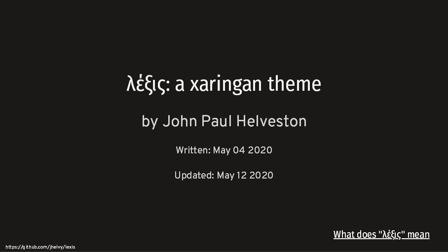

<!-- README.md is generated from README.Rmd. Please edit that file -->

```{r, include = FALSE}
library(fontawesome) # from github: https://github.com/rstudio/fontawesome
knitr::opts_chunk$set(
  collapse = TRUE,
  comment = "#>"
)
dateWritten <- format(as.Date('2020-05-04'), format="%B %d %Y")
today <- format(Sys.Date(), format="%B %d %Y")
```

## by John Paul Helveston

Written: `r dateWritten`

Updated: `r today`

λέξις (lexis) is a theme for the [xaringan R
package](https://github.com/yihui/xaringan) for making slides. It has a light gray background with distinct coloring for code block inputs and outputs. The primary fonts are [Fira Sans Condensed](https://fonts.google.com/specimen/Fira+Sans+Condensed) for headers, [Overpass](https://fonts.google.com/specimen/Overpass) for body text, and [SFMono-Regular](https://developer.apple.com/fonts/) for mono text (i.e. code). The theme copies ideas from several other themes, most notably from [Allison Hill](https://alison.rbind.io/)'s xaringan styling [this workshop](https://github.com/rstudio-education/arm-workshop-rsc2019).

### Demo

- [`r fa("external-link-square-alt", fill = "#007bff")` Preview](https://jhelvy.github.io/lexis/lexis_demo.html){target="_blank"} a live demo.
- [`r fa("external-link-square-alt", fill = "#007bff")` View](https://jhelvy.github.io/lexis/lexis_demo.pdf){target="_blank"} the live demo slides as a pdf.
- [`r fa("download", fill = "#007bff")` Download](https://jhelvy.github.io/lexis/lexis_demo.zip){target="_blank"} the files to create the demo.



### How can I use this theme?

If you'd like to use this theme, include the following in the YAML for your xaringan slides (the `seal: false` bit drops the defaul title page, I like to make my own, like I show in my [demo slides](https://jhelvy.github.io/lexis/lexis_demo.html){target="_blank"}).

````markdown
---
title: "Title"
author: "Author"
output:
  xaringan::moon_reader:
    css: 'https://jhelvy.github.io/lexis/lexis.css'
    lib_dir: libs
    nature:
      highlightStyle: github
      highlightLines: true
      countIncrementalSlides: false
      ratio: "16:9"
    seal: false
---
````

### What does "λέξις" mean?

When communicating an idea to others, there is a fundamental difference between the _content_ of what is be communicated and the _form_ of how it is communicated. Aristotle phrased this as the difference between [λόγος (logos)](https://en.wikipedia.org/wiki/Logos), the logical content of a speech, and [λέξις (lexis)](https://en.wikipedia.org/wiki/Lexis_(Aristotle)), the style and delivery of a speech (see also [this article](http://rhetoric.byu.edu/Encompassing%20Terms/Content%20and%20Form.htm) on content versus form). Since the entire purpose of making a xaringan theme is to customize the _form_ of how content is delivered, "lexis" seemed like an appropriate name.
